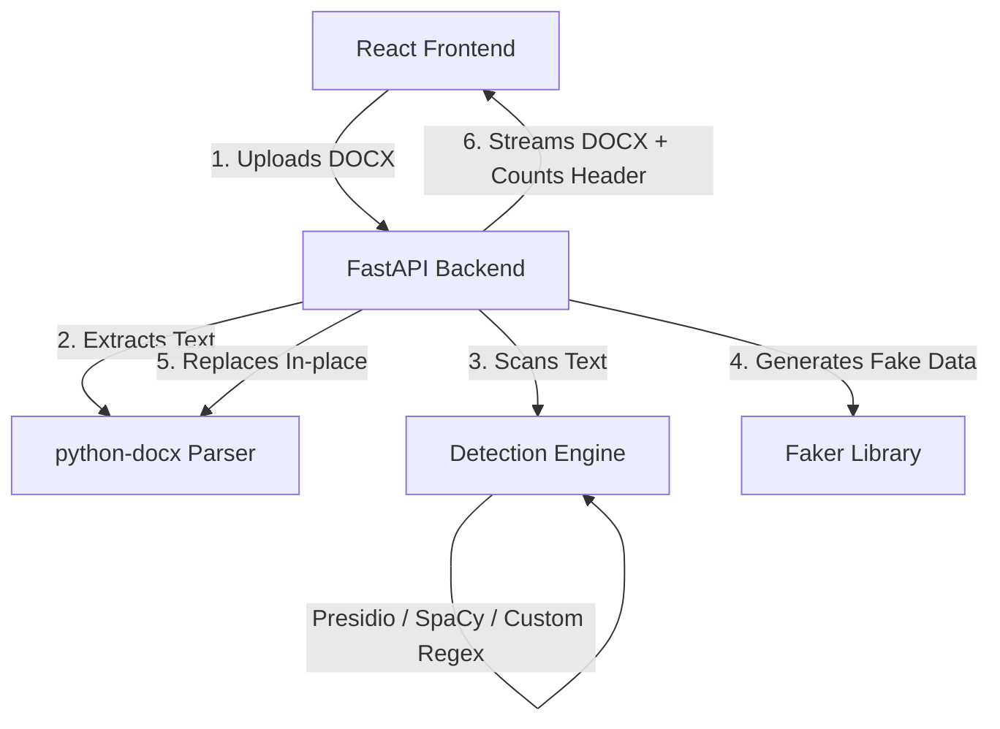

# Architecture Overview

This document describes the high-level architecture, design decisions, and data flow of the PII Redactor application.

---

## 1. Component Overview

The application is structured as a decoupled client-server architecture:

### Frontend (React SPA)
* **Role**: Handles file upload, triggers the backend redaction process, displays detection statistics returned in headers, and manages download of the processed document.
* **Aesthetic**: Minimalist layout with strict sharp-edged (zero-border-radius) UI elements.

### Backend (FastAPI App)
* **Role**: Coordinates the parsing, detection, substitution, and rebuilding of the Word document.
* **Optimization**: Includes performance profiling for each phase (extraction, detection, redaction, and serialization) with console logging.
* **CORS Policy**: Configured to dynamically support production frontend domains via `FRONTEND_URL` and `ALLOWED_ORIGINS` while safely avoiding wildcard conflicts when credential passing is enabled.

---

## 2. Detection Engine & Heuristics

The detector combines named-entity recognition (NER) models with regex patterns and heuristic filters to balance recall and precision.

### Resource Constraint Management
To deploy successfully on resource-constrained platforms (such as Render’s 512MB free tier), the pipeline uses spaCy's lightweight English model (`en_core_web_sm`) rather than larger pre-trained models.

### Multi-Layered Detection
* **Presidio Analyzer**: Detects common entities (Email, Phone, Person, IP address, etc.).
* **Custom Regex Patterns**: Captures physical addresses, dates, and phone numbers that diverge from Western formats.
* **Heuristic Filters**:
  * **Legal/Financial Whitelist**: Matches against a compiled dictionary of standard corporate/prospectus terms (e.g., *Companies Act*, *Board*, *SEBI*) to prevent false positives in legal terminology.
  * **Structured ID Protection**: Bypasses corporate identifiers like PAN, GSTIN, CIN, and ISIN.
  * **Contextual DOB Filter**: Only redacts dates that have proximity to birth-related keywords (e.g., *born*, *birth*, *DOB*) to avoid redacting generic prospectus dates.

---

## 3. Redaction & Preservation Pipeline

To maintain formatting, the redaction engine modifies the document's XML structure in-place.

### Consistent Mapping
Every unique sensitive value identified during the detection stage is mapped to a single synthetic replacement generated by `Faker`. This ensures that if "Sarthak Malvadkar" is replaced by "John Doe" in paragraph 3, the same name is consistently replaced by "John Doe" throughout the entire document.

### Inline/Run-Level Redaction
Microsoft Word splits paragraphs into "runs" based on formatting (bold, italic, fonts, etc.). 
1. The engine attempts to find and replace PII at the **run level** to prevent formatting loss.
2. If a PII span spans across multiple runs (causing individual runs to contain partial words), the engine falls back to **paragraph-level replacement**, rewriting the paragraph text while sacrificing specific character-level formatting in that paragraph to guarantee redaction.
